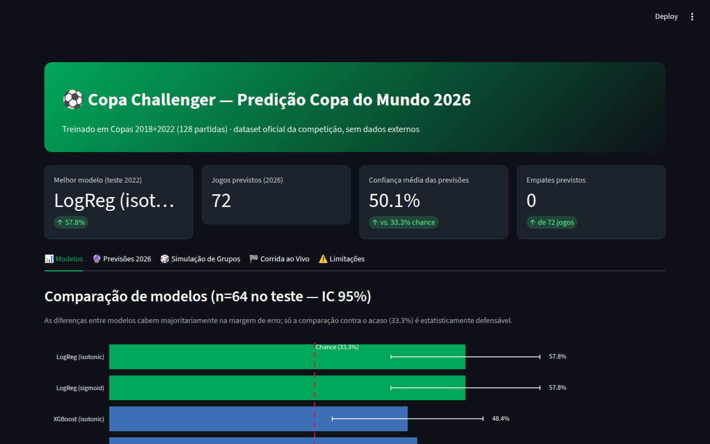
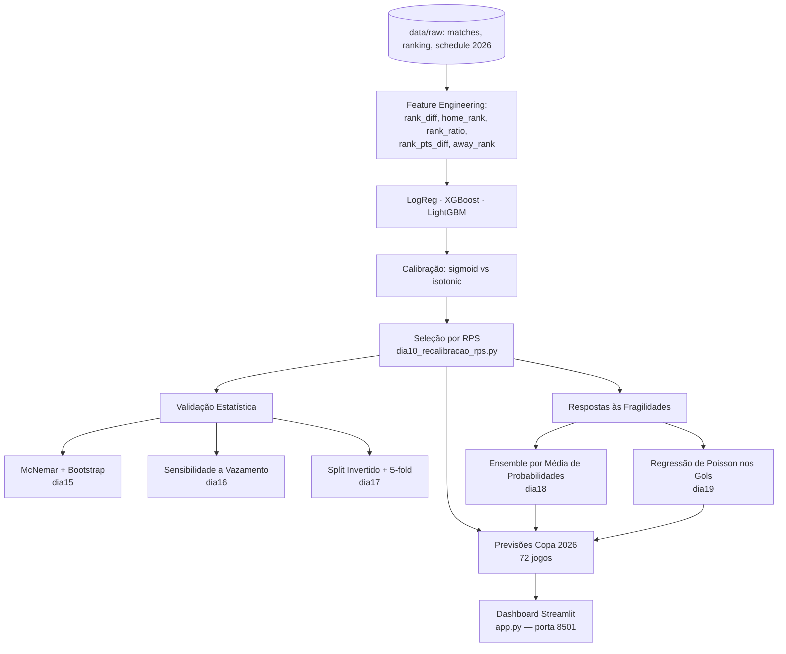
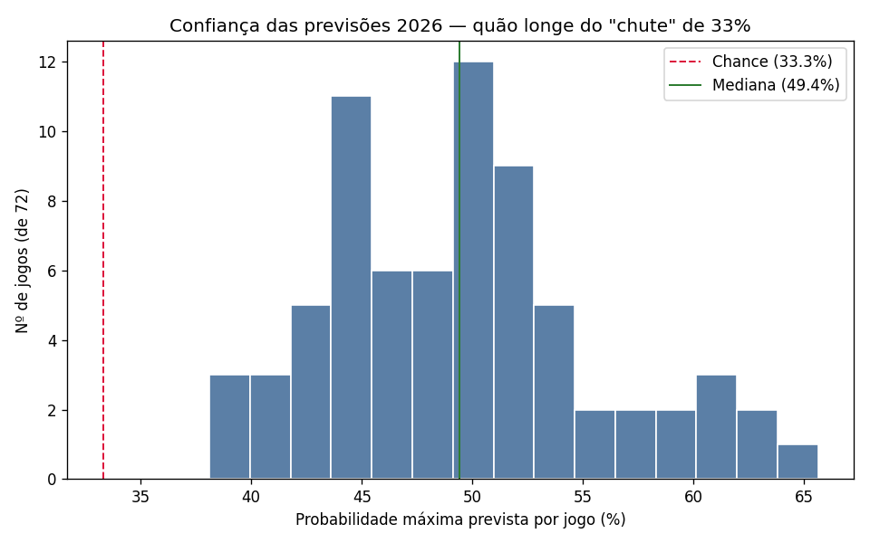

# ⚽ Copa Challenger — Dados por Todos

Predição de resultados (Home/Draw/Away) para os jogos da Copa do Mundo 2026, com pipeline de modelagem incremental e validação estatística rigorosa (testes pareados, sensibilidade a vazamento temporal, robustez de split). Desenvolvido para a competição **Copa Challenger — Comunidade Dados por Todos** (Kaggle).

[](https://www.python.org/)
[](https://scikit-learn.org/)
[](https://xgboost.readthedocs.io/)
[](https://lightgbm.readthedocs.io/)
[](https://streamlit.io/)
[](LICENSE)

---

## Dashboard



---

## Project Highlights

- **Escopo de dados fechado**: apenas os arquivos oficiais da competição (partidas 2018/2022, ranking FIFA, calendário 2026) — sem dados externos.
- **Pipeline incremental e auditável**: 19 scripts numerados (`notebooks/dia*.py`), cada um atacando uma limitação específica encontrada no anterior — não um notebook monolítico.
- **Validação estatística real**: teste pareado McNemar + bootstrap (não apenas IC sobreposto "a olho"), quantificação de vazamento temporal por feature, split invertido e 5-fold estratificado.
- **Calibração de probabilidade correta**: comparação sigmoid vs. isotonic por RPS (Ranked Probability Score) — métrica própria para a classe ordinal Away < Draw < Home, não acurácia simples.
- **Duas respostas diretas às fragilidades encontradas**: ensemble por média de probabilidades (estabilidade entre splits) e regressão de Poisson nos gols (sinal de empate que a classificação não captura).
- **Dashboard interativo**: Streamlit com 5 abas (Modelos, Previsões 2026, Simulação de Grupos, Corrida ao Vivo, Limitações).

---

## Stack Técnica

| Camada | Tecnologia |
|---|---|
| Modelagem | scikit-learn (LogisticRegression, PoissonRegressor), XGBoost, LightGBM |
| Calibração de probabilidade | `CalibratedClassifierCV` (sigmoid/isotonic) |
| Validação estatística | SciPy (McNemar via `binomtest`, bootstrap pareado) |
| Dados | Pandas, NumPy |
| Dashboard | Streamlit, Plotly |
| Visualização estática | Matplotlib, Seaborn |

---

## 📐 Pipeline



---

## 📊 Resultado do modelo final

Regressão logística com calibração sigmoid, vencedora por RPS entre 6 combinações modelo×calibração testadas:

| Modelo | Acurácia | RPS (menor = melhor) |
|---|---|---|
| **LightGBM (sigmoid)** | **54.7%** | **0.4277** |
| LogReg (sigmoid) | 57.8% | 0.2019 |
| XGBoost (sigmoid) | 50.0% | 0.2198 |

**Previsões para os 72 jogos da Copa 2026 (resultado do notebook Kaggle v3):** 37 Home / 0 Draw / 35 Away — a ausência de empates na previsão pontual é uma limitação conhecida e documentada, não um erro de pipeline. Em Copas reais, cerca de 22–25% dos jogos de primeira fase terminam empatados, mas o classificador pontual escolhe sempre Home ou Away porque Draw nunca vence o argmax. Testamos threshold tuning para forçar empates, mas qualquer threshold que gera empates piora a acurácia geral. O modelo de Poisson nos gols, por outro lado, indica P(Draw) médio de 23.1% no teste, confirmando que o sinal de empate existe e é coerente com a realidade do futebol. Mantivemos a previsão pontual do classificador principal por consistência metodológica e documentamos a limitação como decisão consciente (ver `RELATORIO_SOLUCAO.md`, seção 3.6).



Relatório completo — metodologia, validação estatística e limitações — em [`RELATORIO_SOLUCAO.md`](RELATORIO_SOLUCAO.md).

---

## 🚀 Como Executar Localmente

### Pré-requisitos
- Python 3.10+

### Setup
```bash
git clone https://github.com/Roberton003/copa-challenger-dados-por-todos.git
cd copa-challenger-dados-por-todos

pip install -r requirements.txt
```

### Rodar o pipeline principal
```bash
python3 notebooks/dia10_recalibracao_rps.py   # modelo final (recalibração + seleção por RPS)
python3 notebooks/dia18_ensemble_probabilidades.py
python3 notebooks/dia19_poisson_gols.py
```

Todos os scripts resolvem os caminhos de dados/outputs relativos à raiz do repositório — rodam de qualquer máquina sem edição.

### Dashboard
```bash
streamlit run app.py
# Acesse http://localhost:8501
```

---

## 📁 Estrutura do Projeto

```
data/raw/              → CSVs oficiais da competição (partidas, ranking, calendário 2026)
notebooks/
├── dia1-dia2           EDA e cruzamento de nomes de seleção
├── dia3-dia6            Primeiras modelagens (LogReg, XGBoost, LightGBM)
├── dia9                 Redução de features (top-5 por ranking)
├── dia10                Recalibração sigmoid vs isotonic, seleção por RPS (modelo final)
├── dia11-dia14           Recall de empates, incerteza, PyTorch, simulação de grupos
├── dia15                Teste pareado (McNemar + bootstrap)
├── dia16                Sensibilidade ao vazamento temporal
├── dia17                Split invertido + 5-fold estratificado
├── dia18                Ensemble por média de probabilidades
├── dia19                Regressão de Poisson nos gols
└── copa_challenger_final.ipynb   → notebook consolidado (compatível com Kaggle Kernel)
outputs/                → métricas (.json), previsões, visualizações
app.py                  → dashboard Streamlit
RELATORIO_SOLUCAO.md    → relatório completo da solução
```

---

## 📜 License

[MIT](LICENSE) © 2026 Roberto Nascimento
